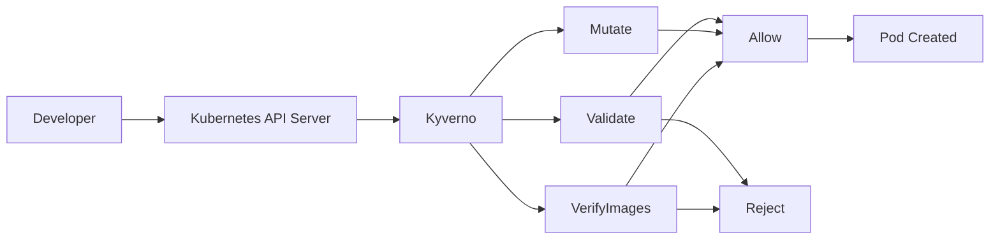
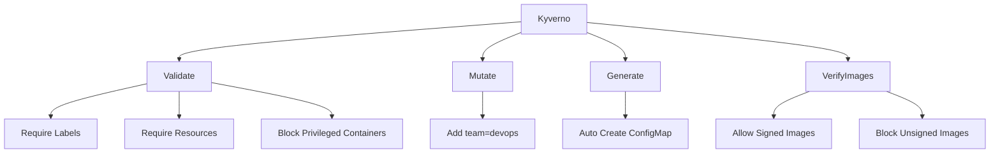
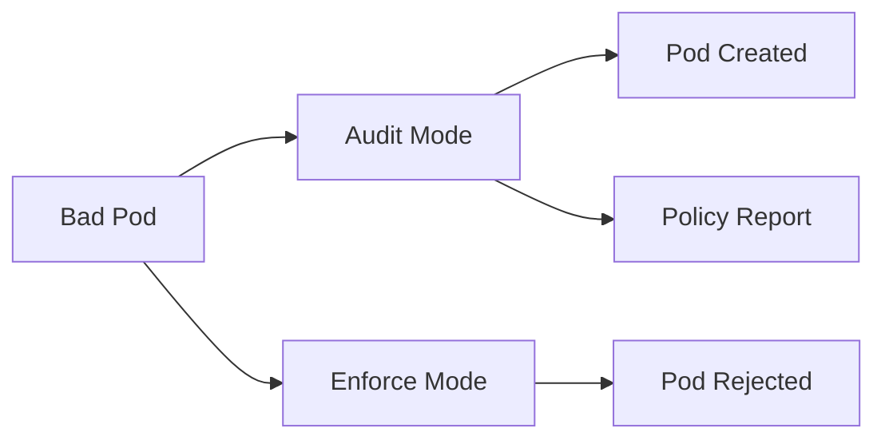
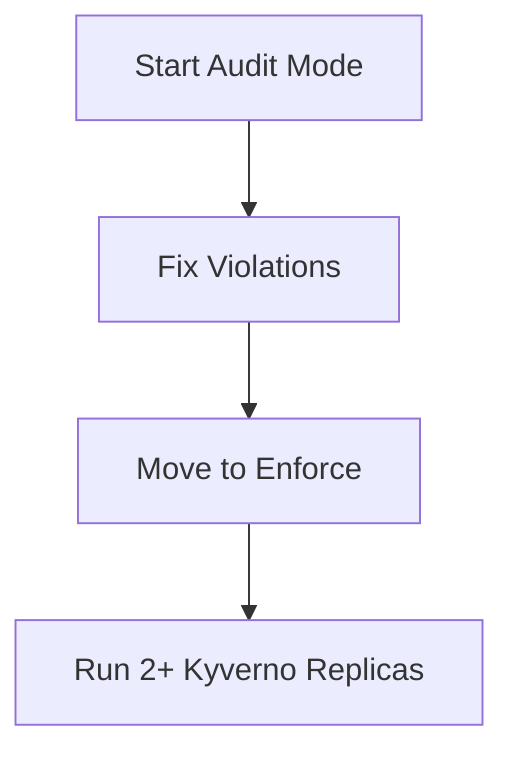

# Kyverno Policy Demo

Hands-on Kubernetes policy management with [Kyverno](https://kyverno.io/) — validate, mutate, generate, and verify container images using plain YAML policies.

Tested on **k3s v1.34.2** with **Kyverno v1.18.1**.

> **Documentation:** Agent entry [`CLAUDE.md`](CLAUDE.md) · Full guide [`docs/complete-guide.md`](docs/complete-guide.md) · Operations [`docs/runbook.md`](docs/runbook.md) · PoC results [`docs/poc-report.md`](docs/poc-report.md)

---

## What is Kyverno?

Kyverno is a Kubernetes-native policy engine. It intercepts `kubectl apply` requests through admission webhooks and can:

| Capability | What it does |
|------------|--------------|
| **Validate** | Check resources against rules — allow or block |
| **Mutate** | Automatically patch resources (labels, defaults, sidecars) |
| **Generate** | Create resources in response to events (e.g. ConfigMap on new Namespace) |
| **VerifyImages** | Verify container image signatures (Cosign) |

Policies are written in Kubernetes YAML — no custom code required.

---

## Architecture

### Kyverno Request Flow



Developer creates Pod → API Server sends request to Kyverno → Kyverno checks policies → Allow or Reject.

### Kyverno Features



### Audit vs Enforce



### Production Recommendation



Start with Audit → fix problems → enable Enforce → run HA in production.

---

## Repository Structure

```
.
├── policies/          # Kyverno ClusterPolicy manifests
├── demos/             # Sample Pods for testing policies
└── notes/             # Rollout plan, baseline docs, one-pager
```

### Policies

| File | Policy Name | Type | Default Mode |
|------|-------------|------|--------------|
| `require-labels.yaml` | `require-labels` | validate | Audit |
| `require-pod-requests-limits.yaml` | `require-requests-limits` | validate | Audit |
| `disallow-privileged-containers.yaml` | `disallow-privileged-containers` | validate | Audit |
| `add-team-label.yaml` | `add-team-label` | mutate | — |
| `generate-configmap.yaml` | `generate-configmap-on-ns` | generate | — |
| `verify-image.yaml` | `verify-image` | verifyImages | Enforce |

### Demo Manifests

| File | Purpose |
|------|---------|
| `bad-no-label.yaml` | Pod missing `app.kubernetes.io/name` label |
| `bad-privileged.yaml` | Pod with `privileged: true` |
| `bad-no-limits.yaml` | Pod without resource requests/limits |
| `good-pod.yaml` | Compliant Pod (passes all baseline policies) |
| `mutate-test.yaml` | Pod for testing auto-label mutation |
| `verify-signed.yaml` | Pod with signed test image |
| `verify-unsigned.yaml` | Pod with unsigned test image (blocked) |

---

## Prerequisites

- Kubernetes cluster (k3s, kind, minikube, or any distro)
- `kubectl` configured
- Kyverno installed in the `kyverno` namespace

### Install Kyverno

```bash
helm repo add kyverno https://kyverno.github.io/kyverno/
helm install kyverno kyverno/kyverno -n kyverno --create-namespace
```

### Create demo namespace

```bash
kubectl create namespace ayoob-kyverno
```

### Verify Kyverno is running

```bash
kubectl get pods -n kyverno
```

---

## Quick Start

### 1. Apply baseline validate policies (Audit mode)

```bash
kubectl apply -f policies/require-pod-requests-limits.yaml
kubectl apply -f policies/disallow-privileged-containers.yaml
kubectl apply -f policies/require-labels.yaml
kubectl get clusterpolicy
```

### 2. Test violations (workloads are allowed in Audit mode)

```bash
kubectl apply -f demos/bad-no-label.yaml
kubectl apply -f demos/bad-privileged.yaml
kubectl apply -f demos/bad-no-limits.yaml
```

### 3. Check PolicyReports

```bash
kubectl get policyreport -n ayoob-kyverno
kubectl describe policyreport -n ayoob-kyverno
```

### 4. Deploy a compliant Pod

```bash
kubectl apply -f demos/good-pod.yaml
kubectl get pods -n ayoob-kyverno
```

---

## Demo Walkthrough

### Validate — Audit vs Enforce

**Audit** (default): violations are logged, workloads still run.

**Enforce**: non-compliant resources are blocked at admission.

To switch `require-labels` to Enforce, edit the policy:

```yaml
validationFailureAction: Enforce
```

Then re-apply and retry:

```bash
kubectl apply -f policies/require-labels.yaml
kubectl apply -f demos/bad-no-label.yaml   # rejected
kubectl apply -f demos/good-pod.yaml       # allowed
```

> Roll out Enforce **one policy at a time**. See `notes/rollout-plan.md`.

---

### Mutate — Auto-add labels

```bash
kubectl apply -f policies/add-team-label.yaml
kubectl apply -f demos/mutate-test.yaml
kubectl get pod mutate-test -n ayoob-kyverno --show-labels
```

Kyverno adds `team=devops` even though it is not in the original YAML.

---

### Generate — Auto-create resources

```bash
kubectl apply -f policies/generate-configmap.yaml
kubectl create namespace ayoob-kyverno-test
kubectl get configmap -n ayoob-kyverno-test
```

Creating a Namespace triggers automatic creation of `kyverno-generated-cm`.

---

### VerifyImages — Signed vs unsigned

```bash
kubectl apply -f policies/verify-image.yaml
kubectl apply -f demos/verify-signed.yaml    # allowed
kubectl apply -f demos/verify-unsigned.yaml  # blocked
```

Uses Kyverno official test images (`ghcr.io/kyverno/test-verify-image`). In production, connect this to your CI/CD Cosign signing pipeline.

---

## Production Considerations

| Topic | Recommendation |
|-------|----------------|
| Rollout | Start with **Audit**, review PolicyReports, then Enforce one policy at a time |
| High availability | Run 2+ admission controller replicas |
| `failurePolicy` | Default `Fail` — if Kyverno is down, admissions are blocked |
| Namespace exclusions | Exclude `kube-system`, `kyverno`, and other system namespaces |
| Image verification | Enable only after Cosign signing is in CI/CD |

```bash
kubectl get validatingwebhookconfiguration kyverno-resource-validating-webhook-cfg -o yaml | grep -A2 failurePolicy
```

More detail: `notes/one-pager.md`, `notes/baseline-policies.md`, `notes/rollout-plan.md`.

---

## Kyverno vs Built-in Alternatives

| Feature | PSA | CEL VAP | Kyverno |
|---------|-----|---------|---------|
| Pod security validation | Yes | Yes | Yes |
| Mutate resources | No | No | **Yes** |
| Generate resources | No | No | **Yes** |
| Verify image signatures | No | No | **Yes** |
| Background scan + PolicyReports | Limited | Limited | **Yes** |
| Ready-made policy library | No | Community | **400+** |

---

## Useful Commands

```bash
# Kyverno health
kubectl get pods -n kyverno

# List policies
kubectl get clusterpolicy

# Check policy mode
kubectl describe clusterpolicy require-labels | grep "Validation Failure Action"

# View violations cluster-wide
kubectl get policyreport -A

# Clean up demo resources
kubectl delete pod bad-no-label bad-privileged bad-no-limits mutate-test verify-signed verify-unsigned good-pod -n ayoob-kyverno --ignore-not-found
kubectl delete ns ayoob-kyverno-test --ignore-not-found
```

---

## References

- [Kyverno Documentation](https://kyverno.io/docs/)
- [Kyverno Policy Library](https://kyverno.io/policies/)
- [Kyverno GitHub](https://github.com/kyverno/kyverno)

---

## License

This project is for educational and demonstration purposes.
