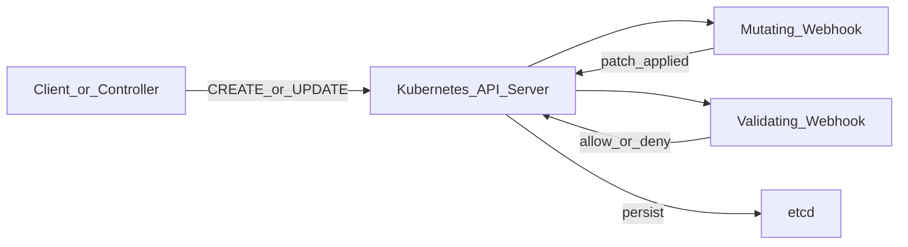
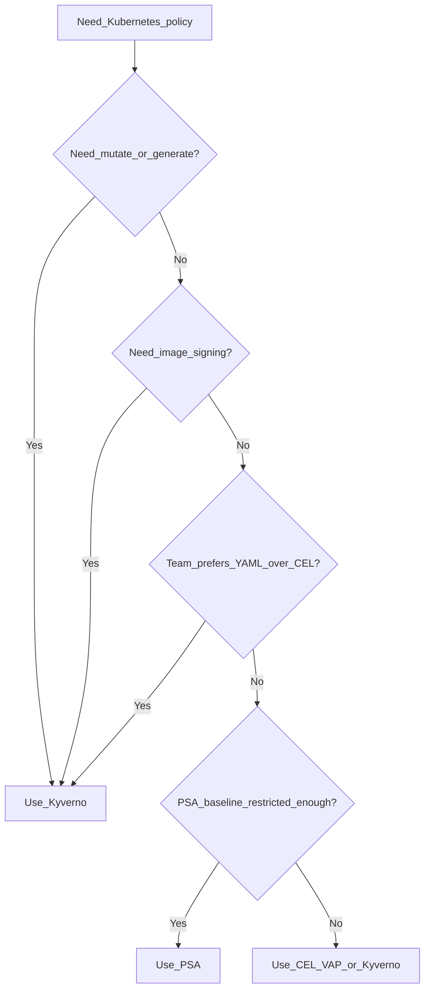
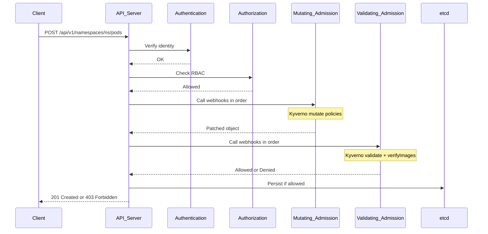
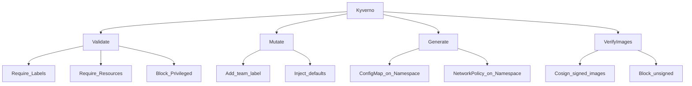
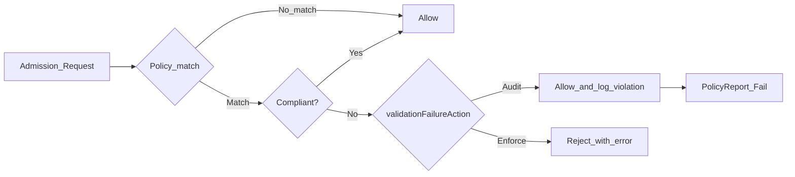
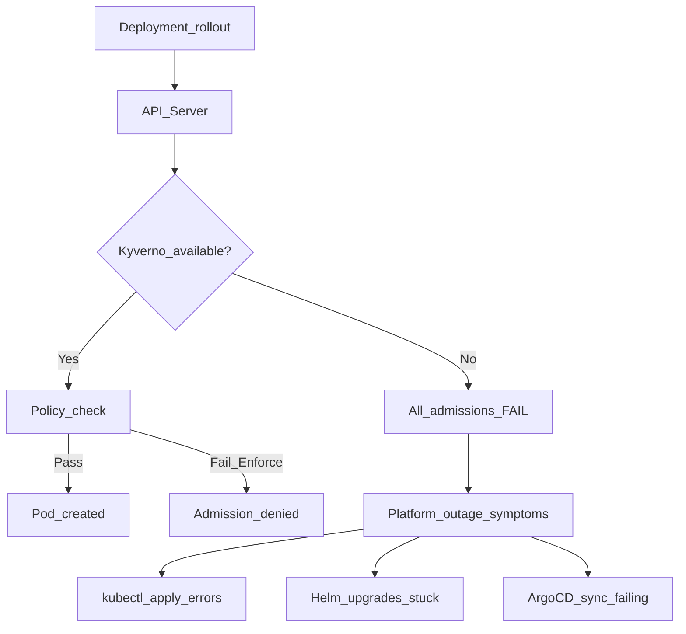
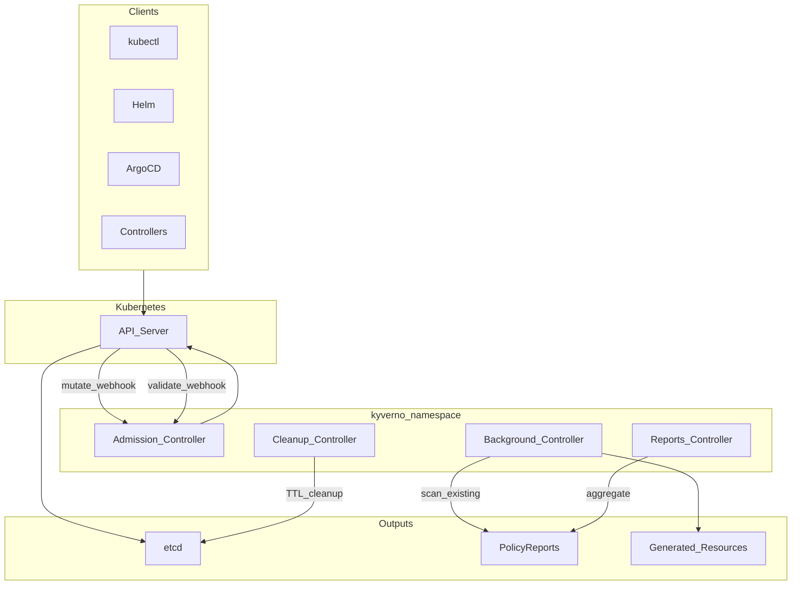
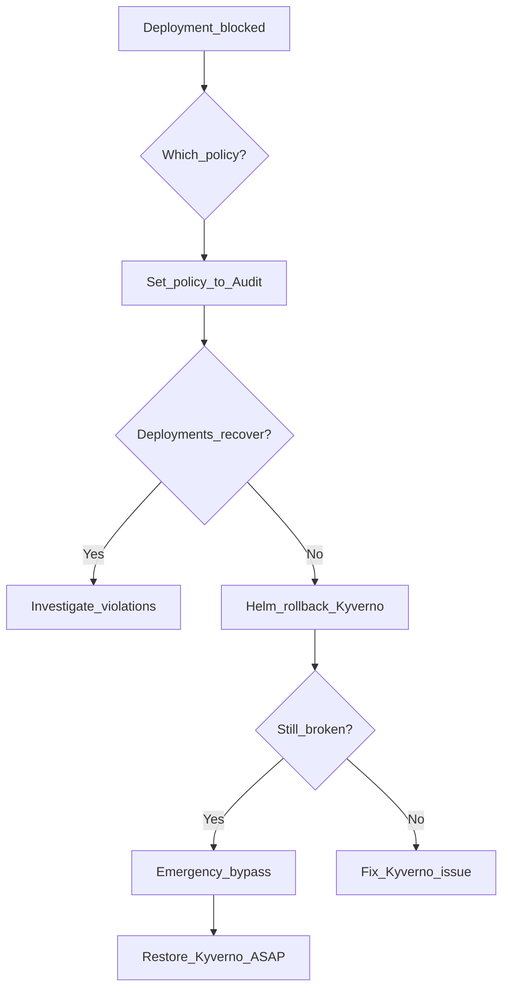
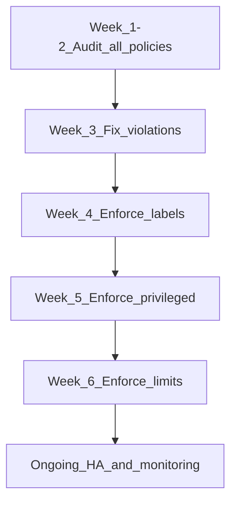
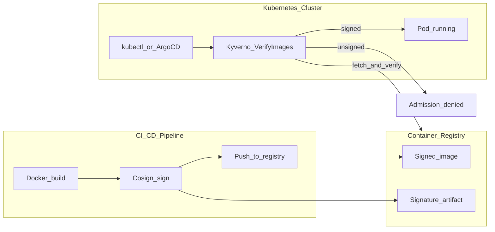

# Kyverno on kubenine — Complete Guide

A full breakdown of this Kyverno setup: what every component is, how admission
policies work, how to install, configure, operate, troubleshoot, and roll out to production.

> **Cluster scope:** Civo K3s (`kubenine-intern` PoC / `kubenine` prod).
> **Install:** Helm + Helmfile (`helmfile sync` from `kyverno/`).
> **Policies:** `policies/` · **Demos:** `demos/` · **Agent entry:** `CLAUDE.md`.
> **Values:** `install/values.yaml` · **Namespace exclusion:** `kyverno` only.

| Field | Value |
|-------|-------|
| **Version** | 1.0 |
| **Last updated** | 2026-06-08 |
| **Tested cluster** | k3s `v1.34.2+k3s1` |
| **Tested Kyverno** | `v1.18.1` |
| **Helm chart** | `kyverno/kyverno` `3.2.6` |
| **Maintainer** | Platform Engineering |
| **Audience** | DevOps Engineers, Platform Engineers, SREs, AI Agents |

---

## Table of Contents

1. [What is Kyverno](#1-what-is-kyverno)
2. [Problems Kyverno Solves](#2-problems-kyverno-solves)
3. [When to Use Kyverno (and When Not To)](#3-when-to-use-kyverno-and-when-not-to)
4. [Kubernetes Admission Control Architecture](#4-kubernetes-admission-control-architecture)
5. [Policy Types](#5-policy-types)
6. [Audit vs Enforce Modes](#6-audit-vs-enforce-modes)
7. [PSA vs CEL ValidatingAdmissionPolicy vs Kyverno](#7-psa-vs-cel-validatingadmissionpolicy-vs-kyverno)
8. [failurePolicy and Production Risks](#8-failurepolicy-and-production-risks)
9. [Kyverno Architecture and Components](#9-kyverno-architecture-and-components)
10. [Installation (Helm)](#10-installation-helm)
11. [Production-Grade Configuration](#11-production-grade-configuration)
12. [Namespace Exclusions](#12-namespace-exclusions)
13. [High Availability Deployment](#13-high-availability-deployment)
14. [Monitoring and Observability](#14-monitoring-and-observability)
15. [Rollback Procedures](#15-rollback-procedures)
16. [Troubleshooting Guide](#16-troubleshooting-guide)
17. [Common Production Issues and Solutions](#17-common-production-issues-and-solutions)
18. [Security Considerations](#18-security-considerations)
19. [Baseline Policy Set](#19-baseline-policy-set)
20. [Rollout Strategy](#20-rollout-strategy)
21. [VerifyImages with Cosign](#21-verifyimages-with-cosign)
22. [Practical YAML Examples](#22-practical-yaml-examples)
23. [Testing Procedures](#23-testing-procedures)
24. [Validation Commands](#24-validation-commands)
25. [Production Readiness Checklist](#25-production-readiness-checklist)
26. [Pros and Cons](#26-pros-and-cons)
27. [Recommendations for KubeNine Production Clusters](#27-recommendations-for-kubenine-production-clusters)
28. [References](#28-references)

---

## 1. What is Kyverno

**Kyverno** (Greek for "govern") is a Kubernetes-native policy engine that enforces, mutates, generates, and verifies resources using declarative YAML policies — no custom language or external policy server required.

Kyverno registers as **admission webhooks** on the Kubernetes API server. Every `kubectl apply`, Helm install, Argo CD sync, or controller reconcile that creates or updates a resource can be intercepted before persistence.

### Core capabilities

| Capability | Kubernetes resource | Admission phase |
|------------|---------------------|-----------------|
| **Validate** | `ClusterPolicy` / `Policy` | Validating webhook |
| **Mutate** | `ClusterPolicy` / `Policy` | Mutating webhook |
| **Generate** | `ClusterPolicy` / `Policy` | Background + admission |
| **VerifyImages** | `ClusterPolicy` / `Policy` | Validating webhook |

Policies are standard Kubernetes CRDs (`kyverno.io/v1`). They can be managed via GitOps, reviewed in pull requests, and versioned like application manifests.

### Request flow



Kyverno participates in both mutating and validating phases depending on policy type.

---

## 2. Problems Kyverno Solves

### Security and compliance gaps

| Problem | Without Kyverno | With Kyverno |
|---------|-----------------|--------------|
| Privileged containers deployed | Discovered post-incident or via periodic scans | Blocked at admission |
| Missing resource limits | Cluster instability, noisy-neighbor outages | Enforced before scheduling |
| Unsigned container images | Supply-chain attack surface | Cosign verification at deploy time |
| Inconsistent labels | Broken monitoring, logging, cost allocation | Validated or auto-mutated |
| Manual policy enforcement | Relies on human review in CI/CD | Enforced cluster-wide, always-on |

### Operational problems

- **Configuration drift** — workloads deployed outside GitOps pipelines bypass CI checks; Kyverno is the last line of defense at the API server.
- **No audit trail for violations** — background scanning produces `PolicyReport` CRDs showing pass/fail per resource.
- **Repetitive platform tasks** — generate NetworkPolicies, ResourceQuotas, or ConfigMaps automatically when namespaces are created.
- **Multi-team clusters** — centralized policy with namespace-scoped exceptions (`Policy`, `PolicyException`).

### What Kyverno does not replace

- CI/CD quality gates (linting, unit tests, SAST)
- Runtime security (Falco, eBPF monitors)
- Network segmentation (CNI policies, service mesh)
- RBAC and identity management

Kyverno complements these layers by enforcing policy at the Kubernetes API boundary.

---

## 3. When to Use Kyverno (and When Not To)

### Use Kyverno when

- You need **mutating admission** (auto-label, inject sidecars, set defaults) — not available in PSA or CEL VAP alone.
- You need **generate policies** (auto-provision resources on namespace creation).
- You need **image signature verification** (Cosign/Sigstore) at deploy time.
- Platform teams want **YAML-native policies** with a library of 400+ community policies.
- You need **background scanning** with `PolicyReport` / `ClusterPolicyReport` for compliance dashboards.
- Multiple teams share a cluster and you need centralized governance with exceptions.

### Do not use Kyverno (or use alternatives) when

| Scenario | Better alternative |
|----------|-------------------|
| Pod Security Standards only (no mutation, no images) | **Pod Security Admission (PSA)** — built-in, zero overhead |
| Simple validation with CEL, no extra controller | **ValidatingAdmissionPolicy (VAP)** — native, no webhook dependency |
| Complex OPA/Rego policies already in production | **Gatekeeper (OPA)** — if team expertise is Rego |
| Single-developer local clusters | Overhead not justified for kind/minikube dev |
| Air-gapped clusters without image registry access for VerifyImages | Defer VerifyImages until signing infra exists |

### Decision matrix



---

## 4. Kubernetes Admission Control Architecture

Admission control is the mechanism by which the API server accepts or rejects resource requests **after** authentication/authorization but **before** persisting to etcd.

### Admission chain



### Webhook types

| Type | Can modify request? | Typical use |
|------|---------------------|-------------|
| **MutatingAdmissionWebhook** | Yes — returns JSON patch | Defaults, labels, sidecars |
| **ValidatingAdmissionWebhook** | No — allow/deny only | Security rules, compliance |

### Kyverno webhook registrations

After Helm install, Kyverno creates:

- `MutatingWebhookConfiguration` — mutate rules
- `ValidatingWebhookConfiguration` — validate and verifyImages rules

Inspect with:

```bash
kubectl get mutatingwebhookconfiguration | grep kyverno
kubectl get validatingwebhookconfiguration | grep kyverno
```

### Match constraints

Policies use `match` blocks to scope rules:

```yaml
match:
  any:
  - resources:
      kinds:
      - Pod
      namespaces:
      - production
      operations:
      - CREATE
      - UPDATE
```

Use `exclude` or `preconditions` for fine-grained control. Prefer `Policy` (namespaced) over `ClusterPolicy` when rules apply to a single tenant namespace.

---

## 5. Policy Types



### 5.1 Validate

**Purpose:** Check resource definitions against rules. Deny non-compliant resources (Enforce) or log violations (Audit).

**Mechanism:** Validating admission webhook. Can also run in background (`background: true`) to scan existing resources.

**Example use cases:**

- Require `app.kubernetes.io/name` label
- Disallow `privileged: true`
- Require CPU/memory requests and limits
- Block `latest` image tags
- Enforce Ingress TLS

**Minimal policy:**

```yaml
apiVersion: kyverno.io/v1
kind: ClusterPolicy
metadata:
  name: require-labels
spec:
  validationFailureAction: Audit
  background: true
  rules:
  - name: check-for-labels
    match:
      any:
      - resources:
          kinds:
          - Pod
    validate:
      message: "The label app.kubernetes.io/name is required."
      pattern:
        metadata:
          labels:
            app.kubernetes.io/name: "?*"
```

**Validation methods:**

| Method | Description |
|--------|-------------|
| `pattern` | Structural matching with wildcards (`?*` = any value) |
| `deny` | CEL-like conditions with `conditions` block |
| `foreach` | Iterate over arrays (containers, volumes) |
| `manifests` | Validate against embedded Kubernetes manifests |

### 5.2 Mutate

**Purpose:** Automatically patch resources at admission time. Runs in the **mutating** webhook phase (before validation).

**Example use cases:**

- Add standard labels (`team`, `environment`)
- Set default resource requests
- Add standard annotations
- Inject image pull secrets reference

**Example policy:**

```yaml
apiVersion: kyverno.io/v1
kind: ClusterPolicy
metadata:
  name: add-team-label
spec:
  rules:
  - name: add-team-label
    match:
      any:
      - resources:
          kinds:
          - Pod
          namespaces:
          - production
    mutate:
      patchStrategicMerge:
        metadata:
          labels:
            team: platform
```

**Mutation types:**

| Type | Use when |
|------|----------|
| `patchStrategicMerge` | Simple field additions (labels, annotations) |
| `patchesJson6902` | Precise JSON Patch operations |
| `foreach` | Per-container mutations |

**Production caution:** Mutations can surprise application teams. Document all mutate policies. Prefer validate-with-clear-error over silent mutation when teams should own the fix.

### 5.3 Generate

**Purpose:** Create new Kubernetes resources in response to events (typically Namespace creation).

**Mechanism:** Admission trigger + background controller maintains synchronized generated resources when `synchronize: true`.

**Example policy:**

```yaml
apiVersion: kyverno.io/v1
kind: ClusterPolicy
metadata:
  name: generate-configmap-on-ns
spec:
  rules:
  - name: generate-configmap
    match:
      any:
      - resources:
          kinds:
          - Namespace
    generate:
      apiVersion: v1
      kind: ConfigMap
      name: platform-defaults
      namespace: "{{request.object.metadata.name}}"
      synchronize: true
      data:
        data:
          created-by: kyverno
          environment: production
```

**Production use cases:**

- Default `NetworkPolicy` per namespace
- `ResourceQuota` per namespace
- `LimitRange` per namespace
- RBAC `RoleBinding` for namespace admins

**Caution:** `synchronize: true` means Kyverno will update or delete generated resources when the policy changes. Test in non-production first.

### 5.4 VerifyImages

**Purpose:** Verify container image signatures and attestations (Cosign, Notary v2) at admission time.

**Mechanism:** Validating webhook. Contacts container registries to fetch signatures. Can mutate image references to digest (`mutateDigest: true`).

**Example policy (demo key — replace in production):**

```yaml
apiVersion: kyverno.io/v1
kind: ClusterPolicy
metadata:
  name: verify-image
spec:
  validationFailureAction: Enforce
  background: false
  webhookTimeoutSeconds: 30
  failurePolicy: Fail
  rules:
  - name: verify-image
    match:
      any:
      - resources:
          kinds:
          - Pod
    verifyImages:
    - imageReferences:
      - "ghcr.io/myorg/*"
      failureAction: Enforce
      mutateDigest: true
      attestors:
      - count: 1
        entries:
        - keys:
            publicKeys: |-
              -----BEGIN PUBLIC KEY-----
              <YOUR_COSIGN_PUBLIC_KEY>
              -----END PUBLIC KEY-----
```

**Production requirements before enabling:**

1. CI/CD pipeline signs every image with Cosign
2. Public keys or KMS references distributed to cluster
3. Registry credentials configured if private
4. `webhookTimeoutSeconds` sized for registry latency
5. Staged rollout — unsigned images will be blocked immediately in Enforce mode

---

## 6. Audit vs Enforce Modes

Controlled by `validationFailureAction` on the policy (or `failureAction` per verifyImages rule).



| Mode | Admission result | PolicyReport | Use case |
|------|------------------|--------------|----------|
| **Audit** | Resource created | `Fail` result recorded | Rollout, discovery, burn-down |
| **Enforce** | Resource rejected | N/A (blocked before creation) | Production hardening |

### Recommended rollout pattern

1. Deploy all new policies in **Audit** for 2–4 weeks.
2. Review `PolicyReport` / `ClusterPolicyReport` weekly.
3. Work with application teams to fix violations.
4. Switch **one policy at a time** to Enforce.
5. Monitor for 48 hours after each Enforce change.

**Never** switch all policies to Enforce simultaneously — this causes widespread deployment failures.

### Background scanning

When `background: true`, Kyverno scans existing resources and produces reports without blocking. Essential for:

- Measuring violation burn-down during Audit phase
- Compliance reporting on resources created before policy existed
- Detecting drift from controllers that bypass admission (rare)

VerifyImages policies typically use `background: false` because signature verification requires registry access and is admission-time only.

---

## 7. PSA vs CEL ValidatingAdmissionPolicy vs Kyverno

### Comparison table

| Feature | PSA | CEL VAP | Kyverno |
|---------|-----|---------|---------|
| **Built into Kubernetes** | Yes (1.23+) | Yes (1.26+ stable) | No — separate install |
| **Pod security validation** | Yes (baseline/restricted) | Yes (custom CEL) | Yes (YAML patterns) |
| **Mutate resources** | No | No | **Yes** |
| **Generate resources** | No | No | **Yes** |
| **Verify image signatures** | No | No | **Yes** |
| **Background scan + reports** | Limited | Limited | **Yes** (PolicyReport CRDs) |
| **Policy language** | Labels on Namespace | CEL expressions | YAML patterns / CEL |
| **Ready-made policy library** | PSS profiles | Community examples | **400+ policies** |
| **Operational overhead** | None | None | Controller pods + webhooks |
| **failurePolicy risk** | N/A | Configurable per policy | Webhook dependency |
| **Multi-resource rules** | Pods only (PSS) | Any resource | Any resource |
| **GitOps friendly** | Namespace labels | VAP YAML | ClusterPolicy YAML |

### When to combine

A mature KubeNine cluster may use all three:

| Layer | Tool | Responsibility |
|-------|------|----------------|
| Namespace baseline | **PSA** `restricted` or `baseline` | Free pod security floor |
| Custom validation | **CEL VAP** or **Kyverno** | Org-specific rules |
| Mutation + generation + images | **Kyverno** | Platform automation and supply chain |

Avoid duplicating the same rule in PSA, CEL VAP, and Kyverno — pick one owner per rule to reduce debugging complexity.

---

## 8. failurePolicy and Production Risks

`failurePolicy` on admission webhooks determines behavior when the webhook is **unreachable or times out**.

| Value | Behavior | Risk |
|-------|----------|------|
| **Fail** (Kyverno default) | Request rejected | Cluster appears "broken" if Kyverno is down — no Pods created |
| **Ignore** | Request allowed without policy check | Cluster works but **unprotected** |

### Production impact of failurePolicy: Fail



### Mitigations (required for production)

| Mitigation | Implementation |
|------------|----------------|
| High availability | 2+ admission controller replicas |
| PodDisruptionBudget | `minAvailable: 1` on admission controller |
| Resource limits | Prevent OOM kills under load |
| Monitoring | Alert on pod restarts, webhook latency, admission errors |
| Namespace exclusions | System namespaces not blocked by app policies |
| Runbook | Document rollback to Audit or temporary webhook bypass |
| Never use Ignore in production | Only for disaster recovery with security team approval |

### Inspect current failurePolicy

```bash
kubectl get validatingwebhookconfiguration kyverno-resource-validating-webhook-cfg \
  -o jsonpath='{.webhooks[*].failurePolicy}' && echo

kubectl get mutatingwebhookconfiguration kyverno-resource-mutating-webhook-cfg \
  -o jsonpath='{.webhooks[*].failurePolicy}' && echo
```

### Webhook timeout

`webhookTimeoutSeconds` on policies (especially VerifyImages) must account for registry round-trips. Default API server timeout is 10 seconds; increase policy timeout up to 30 seconds for image verification.

---

## 9. Kyverno Architecture and Components

Kyverno v1.11+ deploys as multiple controllers in the `kyverno` namespace.



### 9.1 Admission Controller

| Attribute | Detail |
|-----------|--------|
| **Role** | Handles mutate, validate, and verifyImages at admission time |
| **Criticality** | **Critical** — in request path for all matching resources |
| **Scaling** | Horizontal — run 2+ replicas in production |
| **Failure impact** | With `failurePolicy: Fail`, cluster admissions halt if all replicas down |

```bash
kubectl get deployment -n kyverno -l app.kubernetes.io/component=admission-controller
```

### 9.2 Background Controller

| Attribute | Detail |
|-----------|--------|
| **Role** | Scans existing resources against policies with `background: true` |
| **Criticality** | **Important** — not in admission path |
| **Failure impact** | PolicyReports stop updating; admissions unaffected |

Generates and synchronizes resources for `generate` rules with `synchronize: true`.

### 9.3 Reports Controller

| Attribute | Detail |
|-----------|--------|
| **Role** | Aggregates policy results into `PolicyReport` and `ClusterPolicyReport` CRDs |
| **Criticality** | **Important** — compliance visibility |
| **Failure impact** | Reports stale; admissions unaffected |

```bash
kubectl get policyreport -A
kubectl get clusterpolicyreport
```

### 9.4 Cleanup Controller

| Attribute | Detail |
|-----------|--------|
| **Role** | Manages TTL-based cleanup of ephemeral resources and policy reports |
| **Criticality** | **Low** — hygiene |
| **Failure impact** | Old reports accumulate |

### Pod inventory after install

```bash
kubectl get pods -n kyverno -o wide
```

Expected deployments (v1.18.x):

- `kyverno-admission-controller`
- `kyverno-background-controller`
- `kyverno-reports-controller`
- `kyverno-cleanup-controller`

---

## 10. Installation (Helm)

### Prerequisites

| Requirement | Minimum |
|-------------|---------|
| Kubernetes | 1.26+ (tested on 1.34) |
| Helm | 3.x |
| `kubectl` | Configured with cluster-admin or equivalent |

### Standard install (Helmfile)

From `k8-extended/kyverno/`:

```bash
kubectl config use-context kubenine-intern
helmfile sync
```

> Pin the Helm chart version in `helmfile.yaml`. Chart `3.2.6` deploys Kyverno `v1.18.1`. Verify compatibility at [Kyverno releases](https://github.com/kyverno/kyverno/releases).

Alternative direct Helm install (not used in this repo):

```bash
helm repo add kyverno https://kyverno.github.io/kyverno/
helm repo update
helm install kyverno kyverno/kyverno \
  --namespace kyverno \
  --create-namespace \
  --version 3.2.6 \
  -f install/values.yaml
```

### Verify installation

```bash
kubectl get pods -n kyverno
kubectl wait --for=condition=ready pod -l app.kubernetes.io/instance=kyverno -n kyverno --timeout=120s
kubectl get crd | grep kyverno
```

Expected CRDs include: `clusterpolicies.kyverno.io`, `policies.kyverno.io`, `policyreports.wgpolicyk8s.io`, `clusterpolicyreports.wgpolicyk8s.io`.

### Upgrade

```bash
helm repo update
helm upgrade kyverno kyverno/kyverno \
  --namespace kyverno \
  --version <NEW_CHART_VERSION> \
  -f install/values.yaml
```

Review [Kyverno upgrade notes](https://kyverno.io/docs/installation/upgrading/) before minor version jumps.

### Uninstall (emergency only)

```bash
# Delete policies first to avoid orphaned webhooks
kubectl delete clusterpolicy --all
helm uninstall kyverno -n kyverno
```

---

## 11. Production-Grade Configuration

### Recommended Helm values

Create `install/values.yaml`:

```yaml
admissionController:
  replicas: 3
  resources:
    requests:
      cpu: 200m
      memory: 256Mi
    limits:
      memory: 512Mi
  podAntiAffinity:
    preferredDuringSchedulingIgnoredDuringExecution:
    - weight: 100
      podAffinityTerm:
        labelSelector:
          matchLabels:
            app.kubernetes.io/component: admission-controller
        topologyKey: kubernetes.io/hostname

backgroundController:
  replicas: 2
  resources:
    requests:
      cpu: 100m
      memory: 128Mi
    limits:
      memory: 256Mi

reportsController:
  replicas: 2

cleanupController:
  replicas: 1

config:
  # Webhook namespace exclusions — see Section 12
  webhooks:
    namespaceSelector:
      matchExpressions:
      - key: kubernetes.io/metadata.name
        operator: NotIn
        values:
        - kyverno

features:
  policyExceptions:
    enabled: true
    namespace: kyverno

metricsService:
  create: true

serviceMonitor:
  enabled: false   # set true when Prometheus Operator is present
```

Install with Helmfile (preferred in this repo):

```bash
helmfile sync
```

### Configuration principles

| Principle | Rationale |
|-----------|-----------|
| Pin chart version | Reproducible installs |
| Set resource requests/limits | Prevent OOM-induced admission outages |
| Enable PolicyExceptions | Controlled break-glass path |
| Enable metrics | Required for alerting |
| Manage policies via GitOps | PR review, audit trail, rollback |
| Separate values per environment | Dev/staging/prod policy modes differ |

### Policy authoring standards

```yaml
metadata:
  annotations:
    policies.kyverno.io/title: Human-readable title
    policies.kyverno.io/category: Security
    policies.kyverno.io/severity: high
    policies.kyverno.io/subject: Pod
    policies.kyverno.io/description: |
      What this policy does and why it exists.
spec:
  validationFailureAction: Audit   # Always Audit on first deploy
  background: true
```

---

## 12. Namespace Exclusions

The `kyverno` namespace must not be subject to application workload policies. Exclusion prevents Kyverno from blocking its own pods during install, upgrade, or policy enforcement.

### Namespace excluded in this repo (KubeNine PoC)

| Namespace | Reason |
|-----------|--------|
| `kyverno` | Kyverno controllers — avoid recursion and self-blocking |

> For production `kubenine`, consider also excluding `kube-system`, `cert-manager`, `ingress-nginx`, and `monitoring` after platform team review.

### Method 1: Helm webhook namespaceSelector (recommended)

Configured in `install/values.yaml` (see Section 11). Applies globally to all Kyverno webhooks at the webhook configuration level.

### Method 2: Policy-level exclude

```yaml
spec:
  rules:
  - name: require-labels
    match:
      any:
      - resources:
          kinds:
          - Pod
    exclude:
      any:
      - resources:
          namespaces:
          - kube-system
          - kyverno
          - cert-manager
    validate:
      message: "Label required."
      pattern:
        metadata:
          labels:
            app.kubernetes.io/name: "?*"
```

### Method 3: PolicyException (break-glass)

For temporary exclusions of specific resources:

```yaml
apiVersion: kyverno.io/v2
kind: PolicyException
metadata:
  name: emergency-legacy-app
  namespace: kyverno
spec:
  exceptions:
  - policyName: require-requests-limits
    ruleNames:
    - validate-resources
  match:
    any:
    - resources:
        names:
        - legacy-app-*
        namespaces:
        - production
```

**Governance:** PolicyExceptions require platform team approval, expiration dates, and periodic review.

---

## 13. High Availability Deployment

### Minimum production requirements

| Component | Replicas | PDB |
|-----------|----------|-----|
| Admission Controller | **3** (2 minimum) | `minAvailable: 1` |
| Background Controller | 2 | `minAvailable: 1` |
| Reports Controller | 2 | optional |
| Cleanup Controller | 1 | optional |

### PodDisruptionBudget

```yaml
apiVersion: policy/v1
kind: PodDisruptionBudget
metadata:
  name: kyverno-admission-controller
  namespace: kyverno
spec:
  minAvailable: 1
  selector:
    matchLabels:
      app.kubernetes.io/component: admission-controller
```

### Anti-affinity

Spread admission controller pods across nodes (included in production values above). Prevents single-node failure from taking down all replicas.

### Upgrade strategy

1. Upgrade background and reports controllers first (not in admission path).
2. Rolling update admission controller one replica at a time.
3. Verify `kubectl apply` of test Pod after each admission pod restart.
4. Monitor webhook latency during rollout.

### Capacity planning

| Cluster size | Admission CPU | Admission memory |
|--------------|---------------|------------------|
| < 50 nodes | 200m request | 256Mi request |
| 50–200 nodes | 500m request | 512Mi request |
| 200+ nodes | 1000m request | 1Gi request |

Scale based on observed P99 admission latency and CPU throttling.

---

## 14. Monitoring and Observability

### Key metrics (Prometheus)

Kyverno exposes metrics on the admission controller service (port 8000).

| Metric | Alert threshold | Meaning |
|--------|-----------------|---------|
| `kyverno_policy_results_total` | N/A | Pass/fail counts per policy |
| `kyverno_admission_requests_total` | Rate spike | Admission volume |
| `kyverno_admission_request_duration_seconds` | P99 > 1s | Slow admissions |
| `kyverno_admission_review_duration_seconds` | P99 > 500ms | Policy evaluation time |
| Pod restart count | > 3 in 10 min | Instability |

### Recommended alerts

```yaml
# Example PrometheusRule concepts — adapt to your monitoring stack
groups:
- name: kyverno
  rules:
  - alert: KyvernoAdmissionControllerDown
    expr: kube_deployment_status_replicas_available{deployment="kyverno-admission-controller",namespace="kyverno"} < 1
    for: 2m
    labels:
      severity: critical
    annotations:
      summary: Kyverno admission controller has no available replicas

  - alert: KyvernoAdmissionLatencyHigh
    expr: histogram_quantile(0.99, rate(kyverno_admission_request_duration_seconds_bucket[5m])) > 1
    for: 5m
    labels:
      severity: warning
    annotations:
      summary: Kyverno admission latency P99 exceeds 1 second
```

### PolicyReports for compliance

```bash
# Cluster-wide violation summary
kubectl get clusterpolicyreport -o json | \
  jq '.items[].results[] | select(.result=="fail") | {policy: .policy, rule: .rule, message: .message}'

# Per-namespace
kubectl get policyreport -A --no-headers | awk '$3 > 0 {print}'
```

Integrate PolicyReports with:

- Grafana dashboards (via Kyverno Policy Report Reporter or custom exporters)
- Weekly compliance emails to application teams
- CI/CD gates (fail if new violations introduced)

### Logging

```bash
kubectl logs -n kyverno -l app.kubernetes.io/component=admission-controller --tail=100 -f
```

Enable structured JSON logging in Helm values for log aggregation (Loki, Elasticsearch).

---

## 15. Rollback Procedures

### 15.1 Rollback policy to Audit mode

**When:** Enforce policy causes unexpected deployment failures.

```bash
# Edit policy
kubectl edit clusterpolicy require-labels
# Change: validationFailureAction: Audit

# Or via GitOps — revert the commit and sync
kubectl apply -f policies/require-labels.yaml
```

Verify:

```bash
kubectl describe clusterpolicy require-labels | grep "Validation Failure Action"
```

### 15.2 Delete a single policy

```bash
kubectl delete clusterpolicy require-labels
```

Effect is immediate — webhook rules removed on next sync.

### 15.3 Rollback Helm release

```bash
helm history kyverno -n kyverno
helm rollback kyverno <REVISION> -n kyverno
```

### 15.4 Emergency: bypass Kyverno (last resort)

Only with security team approval. Sets webhook `failurePolicy` to `Ignore` or scales admission controller to zero.

```bash
# Option A: Scale down (cluster unprotected)
kubectl scale deployment kyverno-admission-controller -n kyverno --replicas=0

# Option B: Patch webhook failurePolicy (cluster unprotected)
kubectl patch validatingwebhookconfiguration kyverno-resource-validating-webhook-cfg \
  --type='json' \
  -p='[{"op": "replace", "path": "/webhooks/0/failurePolicy", "value": "Ignore"}]'
```

**Document the incident.** Restore Kyverno immediately after resolving root cause.

### Rollback decision tree



---

## 16. Troubleshooting Guide

### Admission denied — policy violation

**Symptom:**

```
Error from server: admission webhook "validate.kyverno.svc" denied the request:
policy require-labels/check-for-labels failed: The label app.kubernetes.io/name is required.
```

**Resolution:**

1. Read the policy name and rule from the error message.
2. Fix the manifest to comply, or request a `PolicyException`.
3. If policy should not apply, check namespace exclusions.

### Internal error — webhook timeout

**Symptom:**

```
Internal error occurred: failed calling webhook "mutate.kyverno.svc": timeout
```

**Resolution:**

1. Check admission controller pod health: `kubectl get pods -n kyverno`
2. Check resource usage: `kubectl top pods -n kyverno`
3. Increase replicas if CPU throttled.
4. For VerifyImages, increase `webhookTimeoutSeconds`.
5. Check registry connectivity from Kyverno pods.

### Policy not matching expected resources

```bash
kubectl describe clusterpolicy <name>
# Check: Ready status, match kinds, namespaces, exclude rules
```

Use `kyverno apply` CLI locally for dry-run testing:

```bash
kyverno apply policies/require-labels.yaml --resource demos/bad-no-label.yaml
```

### PolicyReport not generated

1. Confirm `background: true` on policy.
2. Check background controller logs.
3. Verify reports controller is running.

### Webhook configuration conflict

Multiple policy engines (Kyverno + Gatekeeper) can conflict. Check webhook order:

```bash
kubectl get validatingwebhookconfiguration -o json | \
  jq '.items[] | {name: .metadata.name, webhooks: [.webhooks[].name]}'
```

---

## 17. Common Production Issues and Solutions

| Issue | Symptoms | Root cause | Solution |
|-------|----------|------------|----------|
| Cluster-wide apply failures | All `kubectl apply` fail | Kyverno admission pods down | Scale replicas, check OOM, rollback Helm |
| Argo CD sync failures | SyncError on all apps | Enforce policy too strict | Audit mode, fix manifests, PolicyException |
| Slow deployments | Timeouts on large Helm charts | High policy count, VerifyImages registry latency | Optimize policies, increase timeout, cache |
| Duplicate mutations | Labels added twice | Overlapping mutate policies | Consolidate policies, use `preconditions` |
| Generate policy drift | Unexpected resource deletion | `synchronize: true` policy changed | Test in staging, use `generateExisting: false` |
| VerifyImages false negatives | Signed image blocked | Wrong public key, digest mismatch | Verify Cosign key, check `imageReferences` glob |
| Background scan overload | Background controller OOM | Too many policies + large cluster | Reduce background policies, increase memory |
| Policy not ready | `Ready: false` on ClusterPolicy | Syntax error, CRD version mismatch | `kubectl describe clusterpolicy`, check Kyverno logs |
| Helm install webhook error | Install fails on webhook | API server cannot reach Kyverno service | Check network policies, service endpoints |
| GitOps race condition | Policy applied after workloads | Sync wave ordering | Argo CD sync waves: Kyverno policies wave -1 |

---

## 18. Security Considerations

### RBAC

Kyverno admission controller requires broad permissions to read and patch resources. Run with dedicated ServiceAccount. Restrict who can:

| Action | Who should have access |
|--------|------------------------|
| Create/edit `ClusterPolicy` | Platform team only |
| Create `PolicyException` | Platform + approved break-glass |
| Modify webhook configurations | Cluster admins only |
| Access `kyverno` namespace secrets | Platform team only |

### Policy integrity

- Store policies in Git with branch protection and required reviews.
- Deploy via GitOps (Argo CD, Flux) — not manual `kubectl apply` in production.
- Sign policy commits or use OPA/Gatekeeper-style policy validation in CI.

### VerifyImages key management

| Practice | Detail |
|----------|--------|
| Never commit private keys | Public keys only in policies |
| Use KMS (AWS KMS, GCP KMS, HashiCorp Vault) | Cosign keyless or KMS signing in CI |
| Rotate keys annually | Update policies with new public keys |
| Scope `imageReferences` | Use org-specific globs, not `*` |

### Break-glass

- `PolicyException` with mandatory expiration annotation.
- Quarterly audit of all exceptions.
- Incident log when emergency webhook bypass is used.

### Multi-tenancy

- Use namespaced `Policy` for tenant-specific rules.
- Use `ClusterPolicy` only for org-wide baselines.
- Consider Kyverno `--autogen` settings for Pod controllers (Deployments, etc.).

---

## 19. Baseline Policy Set

KubeNine production baseline: three validate policies. All deploy in **Audit** mode initially.

| Policy | File | Severity | Purpose |
|--------|------|----------|---------|
| `require-labels` | `policies/require-labels.yaml` | medium | Require `app.kubernetes.io/name` |
| `require-requests-limits` | `policies/require-pod-requests-limits.yaml` | medium | CPU/memory requests + memory limits |
| `disallow-privileged-containers` | `policies/disallow-privileged-containers.yaml` | high | Block `privileged: true` |

### 19.1 require-labels

```yaml
apiVersion: kyverno.io/v1
kind: ClusterPolicy
metadata:
  name: require-labels
  annotations:
    policies.kyverno.io/title: Require Labels
    policies.kyverno.io/category: Best Practices
    policies.kyverno.io/severity: medium
    policies.kyverno.io/subject: Pod, Label
    policies.kyverno.io/description: >-
      Validates that the label app.kubernetes.io/name is specified with some value.
spec:
  validationFailureAction: Audit
  background: true
  rules:
  - name: check-for-labels
    match:
      any:
      - resources:
          kinds:
          - Pod
    validate:
      message: "The label `app.kubernetes.io/name` is required."
      pattern:
        metadata:
          labels:
            app.kubernetes.io/name: "?*"
```

### 19.2 require-requests-limits

```yaml
apiVersion: kyverno.io/v1
kind: ClusterPolicy
metadata:
  name: require-requests-limits
  annotations:
    policies.kyverno.io/title: Require Limits and Requests
    policies.kyverno.io/category: Best Practices
    policies.kyverno.io/severity: medium
    policies.kyverno.io/subject: Pod
spec:
  validationFailureAction: Audit
  background: true
  rules:
  - name: validate-resources
    match:
      any:
      - resources:
          kinds:
          - Pod
    validate:
      message: "CPU and memory resource requests and memory limits are required."
      pattern:
        spec:
          containers:
          - resources:
              requests:
                memory: "?*"
                cpu: "?*"
              limits:
                memory: "?*"
          =(initContainers):
          - resources:
              requests:
                memory: "?*"
                cpu: "?*"
              limits:
                memory: "?*"
          =(ephemeralContainers):
          - resources:
              requests:
                memory: "?*"
                cpu: "?*"
              limits:
                memory: "?*"
```

### 19.3 disallow-privileged-containers

```yaml
apiVersion: kyverno.io/v1
kind: ClusterPolicy
metadata:
  name: disallow-privileged-containers
  annotations:
    policies.kyverno.io/title: Disallow Privileged Containers
    policies.kyverno.io/category: Pod Security Standards (Baseline)
    policies.kyverno.io/severity: high
    policies.kyverno.io/subject: Pod
spec:
  validationFailureAction: Audit
  background: true
  rules:
  - name: privileged-containers
    match:
      any:
      - resources:
          kinds:
          - Pod
    validate:
      message: >-
        Privileged mode is disallowed. securityContext.privileged must be unset or false.
      pattern:
        spec:
          =(ephemeralContainers):
          - =(securityContext):
              =(privileged): "false"
          =(initContainers):
          - =(securityContext):
              =(privileged): "false"
          containers:
          - =(securityContext):
              =(privileged): "false"
```

### Apply baseline

```bash
kubectl apply -f policies/require-pod-requests-limits.yaml
kubectl apply -f policies/disallow-privileged-containers.yaml
kubectl apply -f policies/require-labels.yaml
kubectl get clusterpolicy
```

---

## 20. Rollout Strategy



### Phase 1 — Install and Audit (Week 1–2)

- [ ] Install Kyverno with production Helm values
- [ ] Configure namespace exclusions
- [ ] Deploy 3 baseline policies in **Audit** mode
- [ ] Set admission controller to 2+ replicas
- [ ] Verify all policies `Ready: True`
- [ ] Establish weekly PolicyReport review

### Phase 2 — Fix violations (Week 3)

Share PolicyReport results with application teams.

| Violation | Required fix |
|-----------|--------------|
| Missing label | Add `app.kubernetes.io/name: <app>` |
| Missing limits | Add `resources.requests` and `resources.limits` |
| Privileged container | Remove `privileged: true` |

**Success criteria:** Fail count reduced by ≥ 80%.

### Phase 3 — Enforce labels (Week 4)

Easiest fix for teams — one label addition.

```bash
# Set validationFailureAction: Enforce in require-labels.yaml
kubectl apply -f policies/require-labels.yaml
```

Monitor 48 hours. Rollback to Audit if unexpected blocks occur.

### Phase 4 — Enforce privileged block (Week 5)

```bash
kubectl apply -f policies/disallow-privileged-containers.yaml
```

Confirm near-zero privileged violations before enforcing.

### Phase 5 — Enforce resource limits (Week 6)

Most violations typically occur here — enforce last.

```bash
kubectl apply -f policies/require-pod-requests-limits.yaml
```

### Phase 6 — Future additions

| Policy | Type | Prerequisite |
|--------|------|--------------|
| `verify-image` | verifyImages | Cosign signing in CI/CD |
| `add-team-label` | mutate | Team labeling standard agreed |
| `generate-configmap-on-ns` | generate | Namespace provisioning design |

### Golden rules

1. **Never** enforce all policies at once.
2. **Always** run Audit for 2+ weeks before first Enforce.
3. **One policy at a time** to Enforce.
4. **48-hour monitoring** after each Enforce change.
5. **Document rollback** before each Enforce change.

---

## 21. VerifyImages with Cosign

### Supply chain architecture



### CI/CD: Sign images with Cosign

```bash
# Generate key pair (store private key in CI secrets)
cosign generate-key-pair

# Sign after docker push
cosign sign --key cosign.key ghcr.io/myorg/myapp:v1.2.3

# Keyless signing (Sigstore / GitHub Actions)
cosign sign ghcr.io/myorg/myapp:v1.2.3
```

### Production VerifyImages policy

Replace demo key with your organization's public key:

```yaml
apiVersion: kyverno.io/v1
kind: ClusterPolicy
metadata:
  name: verify-image
  annotations:
    policies.kyverno.io/title: Verify Image Signatures
    policies.kyverno.io/category: Software Supply Chain Security
spec:
  validationFailureAction: Enforce
  background: false
  webhookTimeoutSeconds: 30
  failurePolicy: Fail
  rules:
  - name: verify-image
    match:
      any:
      - resources:
          kinds:
          - Pod
    verifyImages:
    - imageReferences:
      - "ghcr.io/myorg/*"
      failureAction: Enforce
      mutateDigest: true
      attestors:
      - count: 1
        entries:
        - keys:
            publicKeys: |-
              -----BEGIN PUBLIC KEY-----
              <PASTE_PRODUCTION_PUBLIC_KEY>
              -----END PUBLIC KEY-----
```

### Demo policy (KubeNine test namespace)

The repository includes a demo policy using Kyverno's public test images (`policies/verify-image.yaml`). Use only in non-production test namespaces.

### Rollout for VerifyImages

1. Implement Cosign signing in CI/CD for all production images.
2. Deploy VerifyImages in **Audit** (use `validationFailureAction: Audit` and `failureAction: Audit`).
3. Review unsigned image violations for 2 weeks.
4. Switch to Enforce per registry glob.
5. Remove `latest` tags — use digests (`mutateDigest: true` helps).

---

## 22. Practical YAML Examples

### Compliant Pod (passes all baseline policies)

```yaml
apiVersion: v1
kind: Pod
metadata:
  name: good-pod
  namespace: ayoob-kyverno
  labels:
    app.kubernetes.io/name: demo
spec:
  containers:
  - name: nginx
    image: nginx:1.25
    resources:
      requests:
        cpu: 100m
        memory: 128Mi
      limits:
        memory: 256Mi
```

### Violation: missing label

```yaml
apiVersion: v1
kind: Pod
metadata:
  name: bad-no-label
  namespace: ayoob-kyverno
spec:
  containers:
  - name: nginx
    image: nginx:1.25
    resources:
      requests:
        cpu: 100m
        memory: 128Mi
      limits:
        memory: 256Mi
```

### Violation: privileged container

```yaml
apiVersion: v1
kind: Pod
metadata:
  name: bad-privileged
  namespace: ayoob-kyverno
  labels:
    app.kubernetes.io/name: demo
spec:
  containers:
  - name: nginx
    image: nginx:1.25
    securityContext:
      privileged: true
    resources:
      requests:
        cpu: 100m
        memory: 128Mi
      limits:
        memory: 256Mi
```

### Violation: missing resource limits

```yaml
apiVersion: v1
kind: Pod
metadata:
  name: bad-no-limits
  namespace: ayoob-kyverno
  labels:
    app.kubernetes.io/name: demo
spec:
  containers:
  - name: nginx
    image: nginx:1.25
```

### VerifyImages: signed image (allowed)

```yaml
apiVersion: v1
kind: Pod
metadata:
  name: verify-signed
  namespace: ayoob-kyverno
  labels:
    app.kubernetes.io/name: demo
spec:
  containers:
  - name: test
    image: ghcr.io/kyverno/test-verify-image:signed
    resources:
      requests:
        cpu: 100m
        memory: 128Mi
      limits:
        memory: 256Mi
```

### VerifyImages: unsigned image (blocked in Enforce)

```yaml
apiVersion: v1
kind: Pod
metadata:
  name: verify-unsigned
  namespace: ayoob-kyverno
  labels:
    app.kubernetes.io/name: demo
spec:
  containers:
  - name: test
    image: ghcr.io/kyverno/test-verify-image:unsigned
    resources:
      requests:
        cpu: 100m
        memory: 128Mi
      limits:
        memory: 256Mi
```

---

## 23. Testing Procedures

### Pre-production policy test

```bash
# Install Kyverno CLI
go install github.com/kyverno/kyverno/cmd/cli/kubectl-kyverno@latest

# Dry-run policy against manifest
kyverno apply policies/require-labels.yaml --resource demos/bad-no-label.yaml
kyverno apply policies/require-labels.yaml --resource demos/good-pod.yaml
```

### Integration test flow (test namespace)

```bash
export TEST_NS=ayoob-kyverno

# 1. Apply policies in Audit mode
kubectl apply -f policies/

# 2. Deploy violation manifests — should succeed in Audit
kubectl apply -f demos/bad-no-label.yaml
kubectl apply -f demos/bad-privileged.yaml
kubectl apply -f demos/bad-no-limits.yaml

# 3. Verify PolicyReports show Fail
kubectl get policyreport -n $TEST_NS
kubectl describe policyreport -n $TEST_NS

# 4. Deploy compliant Pod
kubectl apply -f demos/good-pod.yaml
kubectl get pod good-pod -n $TEST_NS

# 5. Test Enforce (one policy)
# Edit require-labels.yaml → Enforce, re-apply
kubectl apply -f policies/require-labels.yaml
kubectl apply -f demos/bad-no-label.yaml   # expect: denied
kubectl apply -f demos/good-pod.yaml       # expect: allowed

# 6. Cleanup
kubectl delete -f demos/ --ignore-not-found
```

### Mutate policy test

```bash
kubectl apply -f policies/add-team-label.yaml
kubectl apply -f demos/mutate-test.yaml
kubectl get pod mutate-test -n ayoob-kyverno --show-labels
# Expected: team=devops label added
```

### Generate policy test

```bash
kubectl apply -f policies/generate-configmap.yaml
kubectl create namespace ayoob-kyverno-test
kubectl get configmap -n ayoob-kyverno-test
# Expected: kyverno-generated-cm ConfigMap exists
kubectl delete ns ayoob-kyverno-test
```

### VerifyImages test

```bash
kubectl apply -f policies/verify-image.yaml
kubectl apply -f demos/verify-signed.yaml    # allowed
kubectl apply -f demos/verify-unsigned.yaml  # denied
```

---

## 24. Validation Commands

### Kyverno health

```bash
kubectl get pods -n kyverno
kubectl get deployment -n kyverno
kubectl wait --for=condition=available deployment --all -n kyverno --timeout=120s
```

### Policy status

```bash
kubectl get clusterpolicy
kubectl get policy -A
kubectl describe clusterpolicy require-labels
kubectl describe clusterpolicy require-labels | grep "Validation Failure Action"
kubectl describe clusterpolicy require-labels | grep -A5 "Ready"
```

### Webhook configuration

```bash
kubectl get validatingwebhookconfiguration | grep kyverno
kubectl get mutatingwebhookconfiguration | grep kyverno
kubectl get validatingwebhookconfiguration kyverno-resource-validating-webhook-cfg \
  -o yaml | grep -E 'failurePolicy|timeoutSeconds'
```

### Violation reports

```bash
kubectl get policyreport -A
kubectl get clusterpolicyreport
kubectl describe policyreport -n <namespace>
```

### End-to-end admission test

```bash
kubectl run kyverno-test --image=nginx:1.25 --dry-run=server -o yaml
```

### Helm release status

```bash
helm list -n kyverno
helm status kyverno -n kyverno
helm get values kyverno -n kyverno
```

### Metrics endpoint (if enabled)

```bash
kubectl port-forward -n kyverno svc/kyverno-svc-metrics 8000:8000
curl -s localhost:8000/metrics | grep kyverno_policy
```

---

## 25. Production Readiness Checklist

### Infrastructure

- [ ] Kyverno installed with pinned Helm chart version
- [ ] Admission controller: 2+ replicas (3 recommended)
- [ ] PodDisruptionBudget configured
- [ ] Pod anti-affinity across nodes
- [ ] Resource requests and limits set
- [ ] Namespace exclusions configured for system namespaces
- [ ] Prometheus metrics and alerts configured
- [ ] Logs shipped to central aggregation

### Policies

- [ ] Baseline policies deployed in **Audit** mode
- [ ] Policies managed via GitOps with PR review
- [ ] Policy annotations (title, severity, description) complete
- [ ] No duplicate rules across PSA / CEL VAP / Kyverno
- [ ] PolicyException process documented
- [ ] Rollback runbook tested

### Operational

- [ ] Weekly PolicyReport review scheduled
- [ ] On-call runbook includes Kyverno rollback steps
- [ ] Application teams notified of upcoming Enforce dates
- [ ] Violation burn-down ≥ 80% before first Enforce
- [ ] Enforce rollout: one policy per week maximum
- [ ] 48-hour monitoring after each Enforce change

### Supply chain (when ready)

- [ ] Cosign signing in CI/CD for all production images
- [ ] VerifyImages policy tested in Audit
- [ ] Public keys distributed via GitOps
- [ ] Registry credentials for private images configured

### KubeNine status (current)

| Area | Status | Notes |
|------|--------|-------|
| Install Kyverno | Ready | Validated on k3s v1.34.2 |
| Audit mode policies | Ready | Safe to deploy |
| Enforce mode | Pending | Requires 2–4 week burn-down |
| High availability | Not ready | Test cluster has 1 replica |
| Image verification | Not ready | Needs Cosign in CI/CD |
| Namespace exclusions | Needs decision | Confirm monitoring/logging NS |

---

## 26. Pros and Cons

### Pros

| Advantage | Detail |
|-----------|--------|
| Kubernetes-native YAML | No new language; fits GitOps workflows |
| Four policy types in one tool | Validate, mutate, generate, verifyImages |
| Large policy library | 400+ community policies at kyverno.io/policies |
| PolicyReports | Built-in compliance reporting CRDs |
| PolicyExceptions | Controlled break-glass without disabling Kyverno |
| Active community | CNCF incubating project, frequent releases |
| CEL support | Modern validation alongside pattern matching |

### Cons

| Disadvantage | Detail |
|--------------|--------|
| Operational dependency | Webhook in critical path with `failurePolicy: Fail` |
| Resource overhead | 4 controller deployments vs zero for PSA/CEL |
| VerifyImages latency | Registry calls add admission time |
| Learning curve for patterns | `?*`, `=()`, `foreach` syntax is Kyverno-specific |
| Mutation surprises | Teams may not expect auto-modified manifests |
| Version compatibility | Policy schema changes between major versions |
| Not a runtime security tool | Admission-time only; no in-container monitoring |

---

## 27. Recommendations for KubeNine Production Clusters

### Cluster context

| Attribute | Value |
|-----------|-------|
| Distribution | k3s `v1.34.2+k3s1` (Civo) |
| Auth | Pinniped + Azure AD |
| Shared intern cluster | `kubenine-intern-pinniped` context |
| Kyverno version | `v1.18.1` |

### Immediate actions (ready now)

1. **Deploy Kyverno** with production Helm values (3 admission replicas when moving to production clusters).
2. **Apply baseline policies in Audit** — `require-labels`, `require-requests-limits`, `disallow-privileged-containers`.
3. **Exclude `kyverno` namespace** via `install/values.yaml` webhook `namespaceSelector`.
4. **Establish weekly PolicyReport review** with intern teams.
5. **Manage policies via Git** in this repository under `policies/`.

### Short-term (2–6 weeks)

1. Burn down violations to ≥ 80% across application namespaces.
2. Enforce policies one at a time: labels → privileged → limits.
3. Enable Prometheus scraping and critical alerts on admission controller.
4. Document `PolicyException` request process.

### Medium-term (1–3 months)

1. Integrate Cosign image signing in CI/CD pipelines.
2. Deploy VerifyImages in Audit, then Enforce for production namespaces.
3. Add mutate policy for standard labels (`team`, `cost-center`) after team agreement.
4. Evaluate generate policies for default `NetworkPolicy` per namespace.

### Per-environment policy

| Environment | validationFailureAction | VerifyImages |
|-------------|---------------------------|--------------|
| Intern / dev shared | Audit | Demo only in test namespaces |
| Staging | Audit → Enforce (staged) | Audit |
| Production | Enforce (all baseline) | Enforce |

### Namespace strategy

| Namespace pattern | Policy scope |
|-------------------|--------------|
| `ayoob-*` (intern sandboxes) | Full baseline Audit |
| `kyverno` | Excluded (webhook namespaceSelector) |
| Future production apps | Full baseline Enforce + VerifyImages |

### What not to do on KubeNine clusters

- Do not run admission controller with 1 replica in production.
- Do not enable VerifyImages Enforce before CI/CD signing exists.
- Do not set `failurePolicy: Ignore` except during documented emergencies.
- Do not enforce all three baseline policies simultaneously on first rollout.

---

## 28. References

### Official documentation

- [Kyverno Documentation](https://kyverno.io/docs/)
- [Kyverno Policy Library](https://kyverno.io/policies/)
- [Kyverno GitHub](https://github.com/kyverno/kyverno)
- [Kyverno Helm Chart](https://github.com/kyverno/kyverno/tree/main/charts/kyverno)
- [Kyverno Upgrading Guide](https://kyverno.io/docs/installation/upgrading/)

### Kubernetes documentation

- [Admission Controllers](https://kubernetes.io/docs/reference/access-authn-authz/admission-controllers/)
- [Dynamic Admission Control](https://kubernetes.io/docs/reference/access-authn-authz/extensible-admission-controllers/)
- [Pod Security Admission](https://kubernetes.io/docs/concepts/security/pod-security-admission/)
- [ValidatingAdmissionPolicy](https://kubernetes.io/docs/reference/access-authn-authz/validating-admission-policy/)

### Supply chain

- [Cosign Documentation](https://docs.sigstore.dev/cosign/overview/)
- [Kyverno VerifyImages](https://kyverno.io/docs/policy-types/verify-image/)

### KubeNine repository (`k8-extended/kyverno/`)

| Path | Contents |
|------|----------|
| `CLAUDE.md` | Agent entry point — install and test phases |
| `helmfile.yaml` | Helmfile release definition |
| `install/values.yaml` | Production Helm values |
| `policies/` | ClusterPolicy manifests |
| `demos/` | Test workloads (good and bad) |
| `docs/runbook.md` | Operational commands |
| `docs/poc-report.md` | PoC results and go/no-go |
| `docs/complete-guide.md` | This document |

---

*Document maintained by KubeNine Platform Engineering. Open a PR to propose policy or documentation changes.*
