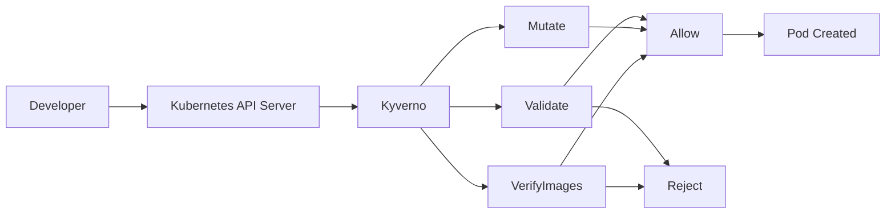
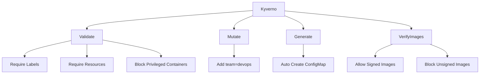
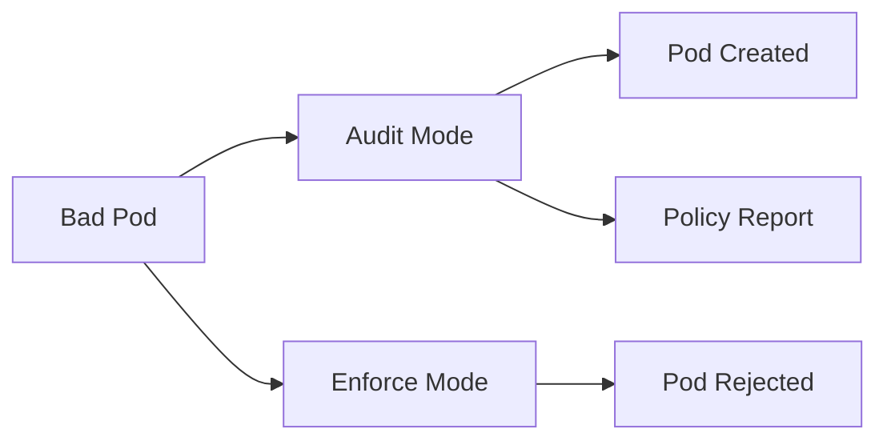
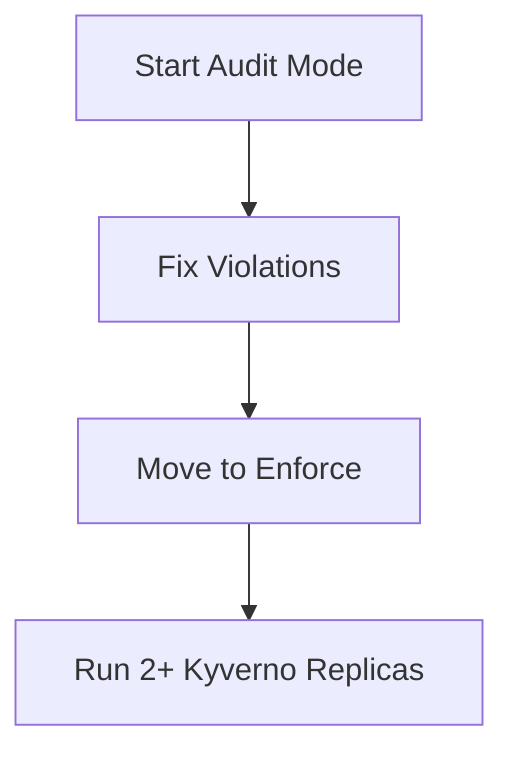

# Kyverno — One Pager

A short summary for the team. Read this in 5 minutes.

---

## What is Kyverno?

Kyverno is a **policy engine for Kubernetes**. It checks every `kubectl apply` **before** the resource is saved.

Think of it as a **security guard at the door**:

- You try to create a Pod
- Kyverno checks the rules
- Good Pod → allowed in
- Bad Pod → blocked (Enforce) or logged (Audit)

**We tested it on:** k3s `v1.34.2`, Kyverno `v1.18.1`, namespace `ayoob-kyverno`

### Request flow



Developer creates Pod → API Server sends request to Kyverno → Kyverno checks policies → Allow or Reject.

---

## What can Kyverno do? (4 types)

| Type | What it does | Example we tested |
|------|--------------|-------------------|
| **validate** | Check rules → allow or block | Require labels, block privileged Pods |
| **mutate** | Auto-fix or add fields | Auto-add `team: devops` label |
| **generate** | Create new resources automatically | New namespace → ConfigMap created |
| **verifyImages** | Check image is signed (Cosign) | Signed image OK, unsigned image blocked |



---

## Audit vs Enforce

| Mode | What happens |
|------|--------------|
| **Audit** | Bad Pod is **still created**, violation is logged |
| **Enforce** | Bad Pod is **blocked** with an error |

**Start with Audit.** Switch to Enforce only after teams fix their workloads.



---

## When should we use Kyverno?

**Use Kyverno when you want:**

- Security rules as simple YAML (no custom code)
- Block bad Pods before they run
- Auto-add labels or defaults (mutate)
- Auto-create NetworkPolicies or quotas (generate)
- Block unsigned container images (verifyImages)
- Reports showing who is breaking rules (PolicyReports)

**You may not need Kyverno if:**

- You only need basic Pod security → built-in **Pod Security Admission (PSA)** might be enough
- You only need simple validation → native **CEL ValidatingAdmissionPolicy** might be enough

---

## Kyverno vs built-in alternatives

| Feature | PSA (built-in) | CEL VAP (built-in) | Kyverno |
|---------|----------------|---------------------|---------|
| Pod security rules | Yes | Yes (you write CEL) | Yes (YAML + library) |
| Mutate resources | No | No | **Yes** |
| Generate resources | No | No | **Yes** |
| Verify image signatures | No | No | **Yes** |
| Background scan + reports | Limited | Limited | **Yes** |
| Ready-made policy library | No | Community | **400+ policies** |

**Bottom line:** Kyverno adds mutation, generation, image verification, and easy YAML policies on top of what Kubernetes already has.

---

## Our baseline policies (3)

| Policy | What it enforces |
|--------|------------------|
| `require-requests-limits` | CPU/memory requests + memory limits on every container |
| `disallow-privileged-containers` | No `privileged: true` containers |
| `require-labels` | Label `app.kubernetes.io/name` must exist |

All start in **Audit** mode. See `baseline-policies.md` for details.

---

## Important risk — failurePolicy

Kyverno sits in the **request path**. If Kyverno is down:

- `failurePolicy: Fail` (default) → **nobody can create Pods** — cluster looks broken
- `failurePolicy: Ignore` → Pods created **without** policy checks — cluster works but unsecured

**Our default is Fail.** That is safer but means we **must** run Kyverno in HA (2+ replicas) and monitor it.

---

## Production readiness verdict

| Area | Status | Notes |
|------|--------|-------|
| Install Kyverno | **Ready** | Works on our k3s test cluster |
| Audit mode policies | **Ready now** | Safe to deploy — logs violations, does not block |
| Enforce mode | **Ready after 2–4 weeks** | Need violation burn-down first |
| High availability | **Not ready** | Test cluster has 1 replica — prod needs 2+ |
| Image verification | **Not ready** | Needs Cosign signing in CI/CD pipeline |
| Namespace exclusions | **Needs decision** | Which namespaces to skip? |

### Overall verdict

> **Kyverno is ready for Audit mode in production today.**
> Enforce mode is ready after teams fix violations and we add HA.
> Full supply-chain security (verifyImages) needs a signing pipeline first.

---

## Rollout summary



Start with Audit → fix problems → enable Enforce → run HA in production.

1. **Week 1–2:** Install Kyverno, apply policies in Audit
2. **Week 3:** Teams fix violations from PolicyReports
3. **Week 4–6:** Enforce one policy at a time

Full plan: `rollout-plan.md`

---

## Open questions for the team

1. **Which namespaces to exclude?** (`kube-system`, `kyverno`, monitoring, etc.)
2. **Who owns policy changes?** Platform team or security team?
3. **PolicyExceptions for emergencies?** How do we allow break-glass deploys?
4. **HA setup?** When do we move to 2+ admission controller replicas?
5. **verifyImages timeline?** When will we sign images with Cosign in CI/CD?
6. **GitOps integration?** How do policies get reviewed and deployed (Argo CD / Flux)?

---

## Quick commands

```bash
kubectl get pods -n kyverno
kubectl get clusterpolicy
kubectl get policyreport -A
kubectl describe clusterpolicy require-labels | grep "Validation Failure Action"